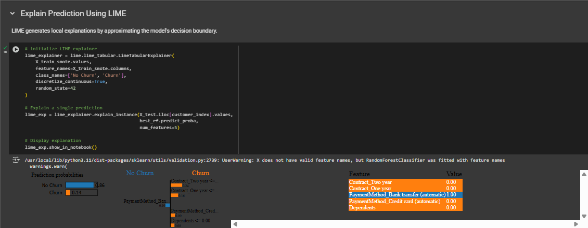

# Telco Customer Churn Prediction

## Overview

This project aims to predict customer churn for a telecommunications company using machine learning. 
The dataset used is the "Telco Customer Churn" dataset from Kaggle. The project involves data exploration, feature engineering, model training, evaluation, and explainability analysis.

## Data Source

The dataset is obtained from Kaggle:
- Dataset Name: Telco Customer Churn [link]("https://www.kaggle.com/datasets/blastchar/telco-customer-churn")

## Methodology

### 1. Data Loading and Initial Exploration

- The dataset is loaded using Pandas.
- Initial exploration involves checking the shape, head, info, and unique values of columns to understand the data structure and potential issues.
- CustomerID is dropped as it's not relevant for modeling.
- Missing values in TotalCharges are replaced with 0.
- Class imbalance in the target variable (Churn) is identified.

### 2. Exploratory Data Analysis (EDA)

- Numerical features (tenure, MonthlyCharges, TotalCharges) are analyzed using histograms and box plots to understand their distributions and identify outliers.
- A correlation heatmap is used to visualize the relationships between numerical features.
- Categorical features are analyzed using count plots to understand their distributions and identify potential relationships with churn.

### 3. Feature Engineering

- New features are engineered to improve model performance:
    - Contract and PaymentMethod are one-hot encoded.
    - AvgCharge is calculated by dividing TotalCharges by tenure.
- These features are selected based on domain knowledge and EDA insights, aiming to capture relevant information for churn prediction.

### 4. Data Preprocessing

- The target variable (Churn) is label encoded.
- Categorical features are label encoded using LabelEncoder.
- Encoders are saved for use during prediction.
- Data is split into training and testing sets using train_test_split with a test size of 0.2 and random_state 42.

### 5. Model Building and Evaluation

- A baseline Logistic Regression model is trained and evaluated using accuracy, confusion matrix, ROC AUC, and classification report.
- SMOTE (Synthetic Minority Oversampling Technique) is applied to address class imbalance in the training data.
  
- Hyperparameter tuning is performed for Logistic Regression and RandomForestClassifier using Optuna to optimize ROC AUC.
- The best models are selected based on cross-validation performance.
  
- Model performance is evaluated on the test set using the same metrics as the baseline model.
  .png)

### 6. Explainability Analysis

- SHAP (SHapley Additive exPlanations) and LIME (Local Interpretable Model-agnostic Explanations) are used to understand feature importance and explain individual predictions.
- SHAP summary plots provide global feature importance.
  
- SHAP waterfall plots explain individual predictions by showing the contribution of each feature.
  
- LIME provides local explanations by approximating the model's decision boundary around specific instances.
  

### 7. Model Deployment

- The best performing model (RandomForestClassifier with tuned hyperparameters) is saved using pickle for deployment.
- A function is provided to load the saved model and make predictions on new data.

## Results and Insights

- The RandomForestClassifier with tuned hyperparameters achieved the best performance, with an accuracy of 78.5% and ROC AUC of 0.848.
- Feature engineering and SMOTE significantly improved model performance compared to the baseline.
- Explainability analysis revealed the most important features for churn prediction, such as Contract, OnlineSecurity, TechSupport, MonthlyCharges, and tenure.
- These insights can be used to develop targeted customer retention strategies and improve business outcomes.
